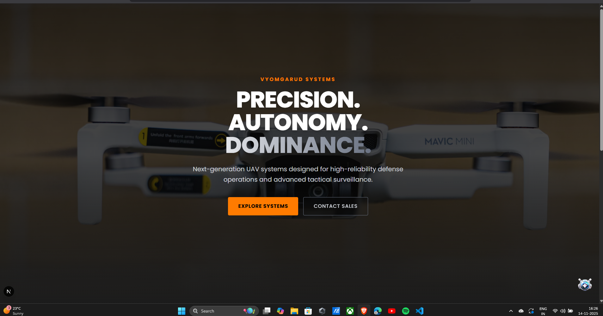
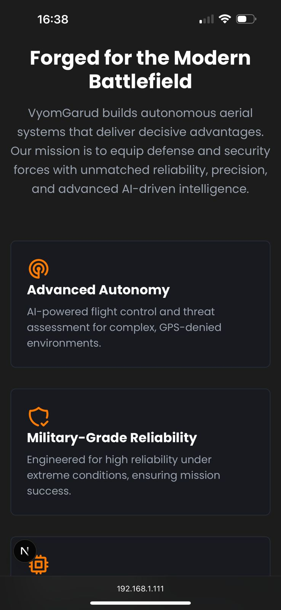

# VyomGarud - Web Developer Intern Assessment

This is a landing page built for the VyomGarud web developer internship assessment. The project is a modern, responsive landing page for a UAV / drone systems company.

### [Live Demo Link (Click Here)](httpsVercellink)

---

## 📸 Screenshots

### Desktop View
(Deskstop-view2.png)

### Mobile View
(Mobile-view2.png)(Mobile-view3.png)

---

## 🚀 Features

* **Modern Aesthetic:** Dark, futuristic, military-grade design using the brand's color palette (Charcoal, White, and Orange `#ff7b00`).
* **Fully Responsive:** Looks great on all devices, from mobile phones to desktops, using Tailwind's mobile-first approach.
* **Subtle Animations:** Smooth fade-in-on-scroll animations using `framer-motion` for a professional, polished feel.
* **Reusable Components:** Built with a clean, component-based architecture in React/Next.js.

---

## 🛠️ Tech Stack

* **Framework:** Next.js (with App Router)
* **Language:** TypeScript
* **Styling:** Tailwind CSS (v4)
* **Animations:** Framer Motion
* **Icons:** React Icons

---

## ⚙️ How to Run Locally

1.  Clone the repository:
    ```bash
    git clone [https://github.com/YOUR_USERNAME/vyomgarud-landing.git](https://github.com/YOUR_USERNAME/vyomgarud-landing.git)
    ```
2.  Navigate to the project directory:
    ```bash
    cd vyomgarud-landing
    ```
3.  Install the dependencies:
    ```bash
    npm install
    ```
4.  Run the development server:
    ```bash
    npm run dev
    ```
5.  Open [http://localhost:3000](http://localhost:3000) in your browser.

---

## 📝 Design & Code Notes

* **Structure:** The project is organized with a `src/components` folder for all reusable components (Hero, About, etc.) and the `src/app` folder for routing.
* **Theme:** The brand colors (`brand-charcoal`, `brand-orange`) are configured in `src/app/globals.css` using Tailwind v4's `@theme` directive.
* **Fonts:** The 'Poppins' font is loaded and optimized via `next/font` in `src/app/layout.tsx`.
* **Responsiveness:** I used Tailwind's `md:` and `lg:` breakpoint prefixes to ensure the layout stacks cleanly on mobile and expands for desktops (e.g., `grid-cols-1 md:grid-cols-3`).
* **Animations:** The `About` and `Highlights` components are marked with `"use client";` to allow Framer Motion to run in the browser.